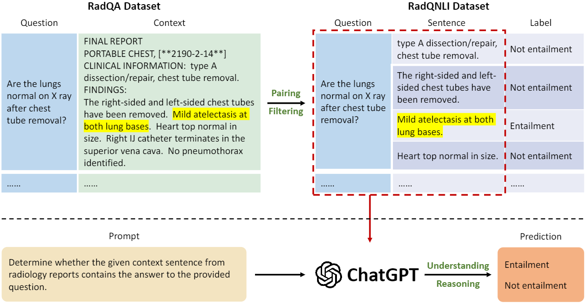

# RadQNLI
The repository is for the paper: [Exploring the Trade-Offs: Unified Large Language Models vs Local Fine-Tuned Models for Highly-Specific Radiology NLI Task](https://arxiv.org/abs/2304.09138), including the code and dataset for reproducing. 

The paper is under revision on IEEE-TBD.

## Pipeline of RadQNLI

Fig. 1: Overview of our workflow. (a) Top panel: Conversion of RadQA dataset to RadQNLI dataset. The highlighted sentence in the context contains the answer to the question. (b) Bottom panel: Utilization of ChatGPT to perform the Natural Language Inference (NLI) task on the generated RadQNLI dataset.


## Prerequisites

[litgpt]([https://github.com/ultralytics/ultralytics](https://github.com/Lightning-AI/litgpt)) repository for LLaMA family evaluation;
```
 pip install 'litgpt[all]'
```


## Getting Started
See [notebooks](notebooks/)


## Dataset Download
See [data](data/). Also, you can download on [Google Drive](https://drive.google.com/drive/folders/1ffmw49aUn1Ie2h7SV3yKeMzU_yM1McNN?usp=sharing).


## Models' Responses
The models' responses are available at [results](results/).  
    - 0e: zero-shot.  
    - 0ecot: zero-shot with CoT.
    - 10e: few-shot (10 shots).
    - 10ecot: few-shot (10 shots) with CoT.

## References
If you find this work or code useful, please cite:

```
@article{wu2023exploring,
  title={Exploring the trade-offs: Unified large language models vs local fine-tuned models for highly-specific radiology nli task},
  author={Wu, Zihao and Zhang, Lu and Cao, Chao and Yu, Xiaowei and Dai, Haixing and Ma, Chong and Liu, Zhengliang and Zhao, Lin and Li, Gang and Liu, Wei and others},
  journal={arXiv preprint arXiv:2304.09138},
  year={2023}
}
```
